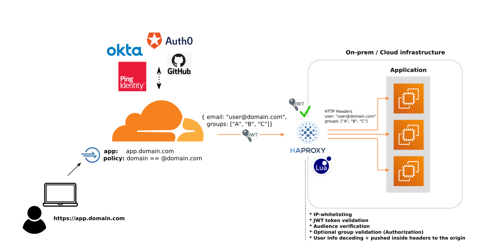

# First steps towards a Zero Trust architecture

Hybrid and multi-cloud infrastructures are a real challenge in term of security
and user accesses management. Traditional solutions like VPNs are usually not
adapted for such scenario, they could still work but at the expense of building
a complex (and costly) web of interconnections and where micro-segmentation of
accesses would be complex to manage. 

This blog post is the first one of a series to document our journey towards Zero
Trust at Kudelski Security. Today we will focus on securing the exposition of
internal application through [Cloudflare Access](https://teams.cloudflare.com/access)
leveraging some tools and code that [we just open-sourced](https://github.com/kudelskisecurity/haproxy-cloudflare-jwt-validator).

# Table of Contents

-   [First steps towards a Zero Trust architecture](#First-steps-towards-a-Zero-Trust-architecture)
    -   [Zero Trust in two lines](#Zero-Trust-in-two-lines)
    -   [Cloudflare Access](#Cloudflare-Access)
    -   [Exposing applications to Cloudflare Access](#Exposing-applications-to-Cloudflare-Access)
-   [Step-by-step implementation](#Step-by-step-implementation)
-   [What are JSON Web Tokens?](#What-are-JSON-Web-Tokens)
-   [What is a JWKs?](#What-is-a-JWKs)
-   [Why should we validate JSON Web Tokens?](#Why-should-we-validate-JSON-Web-Tokens?)
-   [Demo - Signing & Validating your own JWT Locally](#Demo---Signing-&-Validating-your-own-JWT-Locally)
    -   [Dependencies](#Dependencies)
    -   [Run the Test](#Run-the-Test)
    -   [How it works](#How-it-works)
-   [Installing the JWT validation script](#Installing-the-JWT-validation-script)
    -   [Dependencies](#Dependencies-1)
-   [Enabling the plugin](#Enabling-the-plugin)
-   [Authentication validation with JWT](#Authentication-validation-with-JWT)
-   [Authorization validation with JWT](#Authorization-validation-with-JWT)
    -   [App-Based Header Authorization](#App-Based-Header-Authorization)
    -   [HAProxy Based Authorization](#HAProxy-Based-Authorization)
    -   [Refs](#Refs)


## Zero Trust in two lines

Behind the buzzword, Zero Trust is not about making a system trusted it's about
eliminating the trust that we would originally put on the network. So whenever your
users are connecting on your application from the corporate network or from their home
WiFI they will follow the same authentication and authorization workflow.

Identity is one of the building-blocks of a Zero Trust Architecture (Identity Based Security)
that's why Zero Trust is tightly linked to Identity And Accesses Management (IAM) and
device-posture-management but that's probably worth another blog post.

If you want to read more on that topic:

* [What is a Zero Trust Architecture?](https://www.paloaltonetworks.com/cyberpedia/what-is-a-zero-trust-architecture)
* [BeyondCorp model](https://www.beyondcorp.com)
* [BeyondCorp](https://cloud.google.com/solutions/beyondcorp-remote-access)


## Cloudflare Access

[Cloudflare Access](https://teams.cloudflare.com/access) is a SaaS Identity-aware-Proxy (IaP)
developed by [Cloudflare](https://www.cloudflare.com) that can help companies willing
to switch to a Zero Trust model by providing a platform-agnostic solution that covers
most of companies use-cases.


## Exposing applications to Cloudflare Access

Because Cloudflare Access is a SaaS product that is not physically linked to our
datacenters, we needed to find a way to securely expose some of our applications
to Cloudflare CDN over the public Internet. There's multiple ways and technologies
to achieve that (including [Argo tunnels](https://www.cloudflare.com/products/argo-tunnel))
but the solution that we choose and implemented for this particular use-case
leverages HAProxy which is a product that we were already familiar with internally.

We've added some glue on top of HAProxy, augmenting it's functionalities with it's LUA
engine by cryptographically validating requests coming from Cloudflare Access applications.
(on top of doing Layer 4 network validations).




## Step-by-step implementation

This post is a step-by-step guide to implement JSON Web Token (JWT) based
authentication with HAProxy & Cloudflare Access:

[haproxy-cloudflare-jwt-validator](https://github.com/kudelskisecurity/haproxy-cloudflare-jwt-validator)
is a lua script for HAProxy that validates JWT from a Cloudflare JWKS endpoint.
It’s able to handle authorization and authentication because it validates each
request to make sure that it’s associated with the correct Cloudflare Access
Application. It is additionally able to pass any custom information from the
JSON Web Token (like SAML group information) to HAProxy. It also enables the
security of our legacy applications by adding a layer of strong authentication
(external IdP + MFA) and authorization on top of them.

Last but not least, this project is about HAProxy in a Cloudflare Access context
but the code and logic can be applied to anything that uses JWT-based authentication.

    
## What are JSON Web Tokens?

JSON web tokens are an open standard for transmitting information between 2
parties as a JSON object. These tokens can contain user, group and other
information. They can be trusted because they can be verified since they
are digitally signed. Cloudflare signs their JWT tokens with SHA-256 using
a private & public key pair.


## What is a JWKs?

A JSON Web Key set is a JSON structure that exposes public keys and certificates
that are used for validating JSON Web Tokens. Cloudflare exposes their JWKs at
`https://<Your Authentication Domain>/cdn-cgi/access/cert`. Cloudflare
additionally rotates the certificates they use at this endpoint on a regular
basis.


## Why should we validate JSON Web Tokens?

Cloudflare recommends [whitelisting cloudflare
IPs](https://www.cloudflare.com/ips/) and validating the JWT for the
requests that come through. Only whitelisting IPs & failing to validate
JWT means that an attacker can simply add a DNS entry in their
Cloudflare configuration to bypass your IP whitelist. You need to make
sure to validate the JWT token in order to prevent access from a
non-authorized Cloudflare account and to ensure that nothing goes past
your Access Application rules.


## Demo - Signing & Validating your own JWT Locally

We have provided an example here for [signing a JSON web token and
validating the token](https://github.com/kudelskisecurity/haproxy-cloudflare-jwt-validator/tree/master/example)


### Dependencies

The jwt\_test.sh command requires a few dependencies that need to be
installed on your system

-   Docker - <https://docs.docker.com/get-docker/>
-   Docker-compose - <https://docs.docker.com/compose/install/>
-   JQ
    -   (Debian/Ubuntu) `sudo apt-get install jq`
    -   (CentOS) `sudo yum install jq`
    -   (OSX) `brew install jq`
-   jwtgen - `npm install -g jwtgen`


### Run the Test

To run the example... simply run the script ex:

`bash jwt_test.sh`

```
Generating Private Key & Certificate:                             
Generating a RSA private key                                      
................................................................. 
 ...............++++                                                   
................................................................. 
 ............++++                                                      
writing new private key to 'certs/private.key'                    
-----                                                             
                                                                  
Adding Certificate to JWKS Endpoint:                              
done                                                              
Starting example_debug_http_listener_1 ... done                   
Starting example_cloudflare_mock_1     ... done                   
Starting example_haproxy_cloudflare_jwt_validator_1 ... done      
                                                                  
CURL Response with Bad Cf-Access-Jwt-Assertion header:            
<html><body><h1>403 Forbidden</h1>                                
Request forbidden by administrative rules.                        
</body></html>                                                    
                                                                  
CURL Response with Valid Cf-Access-Jwt-Assertion header:          
{                                                                 
  "path": "/",                                                    
  "headers": {                                                    
    "host": "localhost:8080",                                     
    "user-agent": "curl/7.58.0",                                  
    "accept": "*/*",                                              
    "cf-access-jwt-assertion": "eyJ0eXAiOiJKV1QiLCJhbGciOiJSUzI1N 
 iJ9.eyJpYXQiOjE1OTMyMDQ4NTgsImF1ZCI6WyIxMjM0NTY3ODkwYWJjZGUxMjM0NTY3O 
 DkwYWJjZGUxMjM0NTY3ODkwYWJjZGUiXSwiZW1haWwiOiJyYW5kb20tZW1haWxAZW1haW 
 wuY29tIiwic3ViIjoiMTIzNDU2Nzg5MCIsIm5hbWUiOiJKb2huIERvZSIsImFkbWluIjp 
 0cnVlLCJpc3MiOiJodHRwOi8vY2xvdWRmbGFyZV9tb2NrIiwibmJmIjoxNTkzMjA0ODU4 
 LCJleHAiOjM5OTMyMDQ4NTgsInR5cGUiOiJhcHAiLCJpZGVudGl0eV9ub25jZSI6IjExM 
 TExMTExMTExIiwiY3VzdG9tIjp7fX0.xq1KyxFrOt4-6iAlMqVJ8rORA72OJuZVk9gzd5 
 nvQ4yqs8MFGTqERp1ggTxF99ieBZ_PDg79jL6NCI_bxxDPCpplX8foUb-XqbS0ppsIrS1 
 H-NWOsOYMg4KCs7vkj0_g5eforln8aFdCEG1ToA61DqFM2epAxAk5zuHfjwz7aBtk2eNC 
 RjHgQ692TpwPDdzFsllty4xLfzSbePpEira5pNwBEPFHZnq-ISjpx2d4g6zZUMYMbAX7h 
 N4RI7NltUxlroQUJDnMIUA7BEVMFsRgqpNpWE3wZbxCprqKXHH9WwhkFebKIQMFyW4KlY 
 QuDH7htV-uuCaWqwPm4ke4PDY2w3Hjvds5Zne5SAblmkdJBXTx2fDOCLIIv1t0-Pnf_T_ 
 3nzmKd_yMQaORRrX9-4lcOWmUoQ1E3pbLcLSQtjvziEFzjcNmcTE1aTtDo6UlLyOEPJpx 
 b58WrJOrQwo3-jZON1PReCnuZArsfqoE8qPbPTLjMCYkFKNs6WfnXzmLOtTQmVeCMJpG4 
 QtHVZMDC3GlmDi9RJaribjc0sWbJrPCNqMmdl3dQ3GAspkWDrHW-BWxJ5koCNnToWMEy5 
 ybG1pTb7Tefd98GamEwhIpENW7z9YF2jPcNeZ8BxmQwna56E0cAQHdTqH-5BaWDDSCLv2 
 nAy0wzUYMRPKiOVVu1PaZQNU",                                            
    "x-forwarded-for": "172.20.0.1",                              
    "connection": "close"                                         
  },                                                              
  "method": "GET",                                                
  "body": "",                                                     
  "fresh": false,                                                 
  "hostname": "localhost",                                        
  "ip": "172.20.0.1",                                             
  "ips": [                                                        
    "172.20.0.1"                                                  
  ],                                                              
  "protocol": "http",                                             
  "query": {},                                                    
  "subdomains": [],                                               
  "xhr": false,                                                   
  "os": {                                                         
    "hostname": "08afc040418e"                                    
  },                                                              
  "connection": {}                                                
Stopping example_haproxy_cloudflare_jwt_validator_1 ... done      
Stopping example_debug_http_listener_1              ... done      
Stopping example_cloudflare_mock_1                  ... done      
```


### How it works

To start off, we generate a private key and a certificate with openssl.
We stick with default values just because this is a demo scenario and it
doesn’t matter for this test.

```bash
openssl req -new -newkey rsa:4096 -days 365 -nodes -x509 \        
    -subj "/C=US/ST=Denial/L=Springfield/O=Dis/CN=www.example.com 
 " \                                                                   
    -keyout certs/private.key  -out certs/certificate.pem         
```

We then take the certificate that was generated, and expose it to the
JWKS endpoint (we are running a simple python server that exposes files
just for demo purposes).

```
CERT=$(cat certs/certificate.pem)                                 
jq -n --arg cert "$CERT" '{public_certs: [{kid: "1", cert: $cert} 
 , {kid: "2", cert: $cert}]}' \                                        
  > cloudflare_mock/cdn-cgi/access/certs && echo "done"           
```

We then use a custom claim to generate a JWT token.

```bash
CLAIM='{
  "aud": [
    "1234567890abcde1234567890abcde1234567890abcde"
  ],
  "email": "random-email@email.com",
  "sub": "1234567890",
  "name": "John Doe",
  "admin": true,
  "iss": "http://cloudflare_mock",
  "iat": 1593204858,
  "nbf": 1593204858,
  "exp": 3993204858,
  "type": "app",
  "identity_nonce": "11111111111",
  "custom": {}
}'
JWT_TOKEN=$(jwtgen -a RS256 -p certs/private.key --claims "$CLAIM")
curl -H "Cf-Access-Jwt-Assertion: ${JWT_TOKEN}" localhost:8080
```

The jwtverify.lua script then gets triggered via the defined HAProxy
backend. It decodes the token, validates the algorithm, signature,
expiration, issuer, and audience.

## Installing the JWT validation script

### Dependencies

The haproxy-cloudflare-jwt-validation lua script requires a few
dependencies that need to be installed on your system;

Debian/Ubuntu Instructions:

```bash
sudo apt install lua5.3 liblua5.3-dev wget make libssl-dev
sudo mkdir -p /usr/local/share/lua/5.3
```

[haproxy-lua-http](https://github.com/haproxytech/haproxy-lua-http):

```bash
wget https://github.com/haproxytech/haproxy-lua-http/archive/master.tar.gz
tar -xf master.tar.gz -C /usr/local/share/lua/5.3
cp /usr/local/share/lua/5.3/haproxy-lua-http-master/http.lua /usr/local/share/lua/5.3/http.lua
```

[rxi/json](https://github.com/rxi/json.lua):

```bash
wget https://github.com/rxi/json.lua/archive/v0.1.2.tar.gz
tar -xf v0.1.2.tar.gz -C /usr/local/share/lua/5.3
ln -s /usr/local/share/lua/5.3/json.lua-0.1.2/json.lua /usr/local/share/lua/5.3/json.lua
```

[wahern/luaossl](https://github.com/wahern/luaossl):

```bash
wget https://github.com/wahern/luaossl/archive/rel-20190731.tar.gz
tar -xf rel-20190731.tar.gz -C /usr/local/share/lua/5.3
cd /usr/local/share/lua/5.3/luaossl-rel-20190731
make install
```

[diegonehab/luasocket](https://github.com/diegonehab/luasocket)

```bash
wget https://github.com/diegonehab/luasocket/archive/master.tar.gz
tar -xf master.tar.gz -C /usr/local/share/lua/5.3
cd /usr/local/share/lua/5.3/luasocket-master
make clean all install-both LUAINC=/usr/include/lua5.3
```

Once the dependencies are installed install the latest release of the
plugin:

<https://github.com/kudelskisecurity/haproxy-cloudflare-jwt-validator/releases/latest>

```bash
tar -xf haproxy-cloudflare-jwt-validator-${VERSION}.tar.gz -C /usr/local/share/lua/5.3
ln -s /usr/local/share/lua/5.3/haproxy-cloudflare-jwt-validator-${VERSION}/src/base64.lua /usr/local/share/lua/5.3/base64.lua
ln -s /usr/local/share/lua/5.3/haproxy-cloudflare-jwt-validator-${VERSION}/src/jwtverify.lua /usr/local/share/lua/5.3/jwtverify.lua
```

## Enabling the plugin

Once the lua script is installed… the plugin can be enabled by enabling
the following configuration options in `/etc/haproxy/haproxy.cfg`
(replace `test.cloudflareaccess.com` with your JWT issuer)

```
global
  lua-load  /usr/local/share/lua/5.3/jwtverify.lua
  setenv  OAUTH_HOST     test.cloudflareaccess.com
  setenv  OAUTH_JWKS_URL https://|cloudflare_jwt|/cdn-cgi/access/certs
  setenv  OAUTH_ISSUER   https://"${OAUTH_HOST}"

backend cloudflare_jwt
  mode http
  default-server inter 10s rise 2 fall 2
  server "${OAUTH_HOST}" "${OAUTH_HOST}":443 check resolvers dnsresolver resolve-prefer ipv4

resolvers dnsresolver
  nameserver dns1 1.1.1.1:53
  nameserver dns2 1.0.0.1:53
  resolve_retries 3
  timeout retry 1s
  hold nx 10s
  hold valid 10s
```

## Authentication validation with JWT

In addition to validating the JWT token with
haproxy-cloudflare-jwt-validator, it’s recommended to block and only
[whitelist cloudflare IPs](https://www.cloudflare.com/ips/) for your
publicly exposed endpoint in your firewall.

The haproxy-cloudflare-jwt-validator script performs authentication on
your pre-defined backend or frontend.

For example:

```
backend my_jwt_validated_app_backend
  mode http
  http-request deny unless { req.hdr(Cf-Access-Jwt-Assertion) -m found }
  http-request set-var(txn.audience) str("1234567890abcde1234567890abcde1234567890abcde")
  http-request lua.jwtverify
  http-request deny unless { var(txn.authorized) -m bool }
  server haproxy 127.0.0.1:8080
frontend my_jwt_validated_app_frontend
  bind *:80
  mode http
  use_backend my_jwt_validated_app_backend
```

Using the configuration above… when a HTTP request comes through to port
80 the following checks are performed:

-   Validates that the `Cf-Access-Jwt-Assertion` Header is set

-   Validates that the Algorithm of the token is RS256

-   Validates that the at least one public key from the JWKS
    certificates match the public key for the signed JSON Web Token

-   Validates that the token is not expired

-   Validates that the Issuer of the token matches the predefined issuer
    from the `OAUTH_ISSUER` ENV variable

-   Validates that the audience tag from the JWT token matches the
    audience tag that we expect for this backend

Assuming that all of the above checks pass… the request is then allowed.
If any of the above checks fail. HAProxy will respond with a 403
(Unauthorized) error.

## Authorization validation with JWT

App authorization runs under the assumption that you can pass
information from Cloudflare such as group information, permissions, etc
... as part of the JWT token.

For example, when you add an SAML Identity Provider to Cloudflare
Access… you can define a list of SAML attributes that will get included
as part of the encoded JSON Web Token. These attributes are passed
through as variables that can be used in headers, HAProxy
authentication, or even other lua scripts.

When you configure SAML attributes successfully, you will see them
included as part of the decoded JSON Web Token as part of the ‘custom’
key. Ex:

```
{
  ...
  "email": "random-email@email.com",
  "name": "John Doe",
  "custom": {
    "http://schemas/groups": [
      "application_admin",
      "application_group1",
      "application_group2",
      "application_group3"
    ]
  }
}
```

The haproxy-cloudflare-jwt-validate script will take the keys defined in
“custom” and declare haproxy variables with them. (This will strip out
special characters and replace them with an underscore)

For example: `http://schemas/groups` becomes `txn.http___schemas_groups`

### App-Based Header Authorization

Now that we’ve defined our variable `txn.http___schemas_groups`… you can
then pass this variable through to the headers. Every request that comes
through will pass this header information to the backend by simply using
`set-headers`.

```
backend my_jwt_validated_app_backend
  mode http
  http-request deny unless { req.hdr(Cf-Access-Jwt-Assertion) -m found }
  http-request set-var(txn.audience) str("1234567890abcde1234567890abcde1234567890abcde")
  http-request lua.jwtverify
  http-request deny unless { var(txn.authorized) -m bool }
  http-request set-header custom-groups %[var(txn.http___schemas_groups)]
  server haproxy 127.0.0.1:8080
```

Your app can read the headers, create your user based off of these
headers, and assign it group information.

### HAProxy Based Authorization

Another alternative that we can do, is we can validate the presence of a user's group 
via HAProxy directly. For example in the following scenario, HAProxy will not grant a 
user access unless they belong to the `application_admin` group.

```
backend my_jwt_validated_app_backend
  mode http
  http-request deny unless { req.hdr(Cf-Access-Jwt-Assertion) -m found }
  http-request set-var(txn.audience) str("1234567890abcde1234567890abcde1234567890abcde")
  http-request lua.jwtverify
  http-request deny unless { var(txn.authorized) -m bool }
  http-request deny unless { var(txn.http___schemas_groups) -m sub application_admin }
  server haproxy 127.0.0.1:8080
```


## Next steps

* Device posture management
* IAM strategy ...

## Refs

- [JWT](https://jwt.io/introduction)
- [haproxy-lua-jwt](https://github.com/haproxytech/haproxy-lua-jwt)
